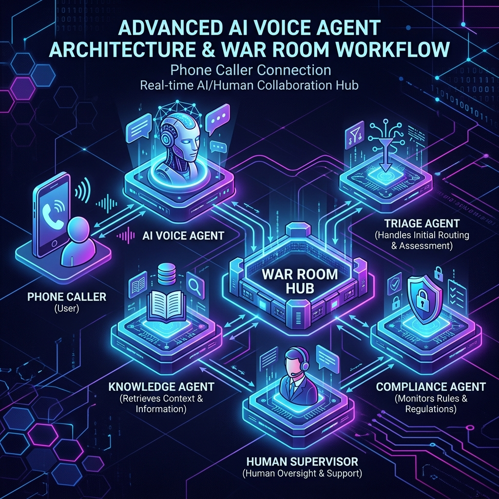
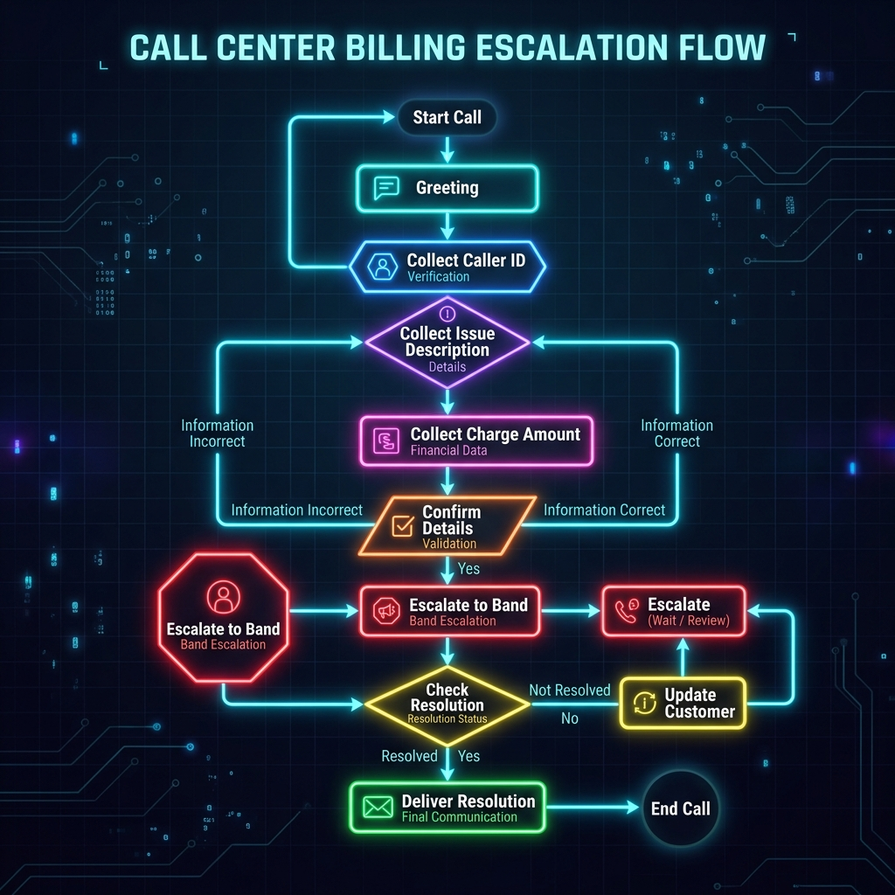

# 🎧 Renggo: Live Escalation War Room
**Band of Agents Hackathon (June 12–19, 2026)**

[](LICENSE)
[](https://www.python.org)
[](https://docs.band.ai)

> **Live voice AI that escalates hard calls to a Band room of specialist agents + human approval — and resolves them before the caller hangs up.**

---

## 🛑 The Problem
Current AI call center agents operate in isolation. When they hit a wall—whether it's a complex policy question, a high-stakes compliance issue, or a situation requiring human authorization—they fail. They either hallucinate, give up, or force the user to navigate a clunky transfer to a human queue.

## 🚀 The Solution: A Band of Agents "War Room"
We bridge **Renggo** (a real-time, full-duplex voice AI) with a **Band of Agents** War Room. 
Mid-call, the voice agent seamlessly delegates the problem to a multi-agent backend. Behind the scenes:
1. **Triage** categorizes the issue.
2. **Knowledge** retrieves the exact policy.
3. **Compliance** ensures the resolution is legal.
4. **Human Supervisors** can jump into the Band UI to approve high-stakes actions.

All in seconds, while the caller is still on the line.

---

## 🧠 How It Works (The Flow)



### 🔮 The Outbound Call Scenario (Theoretical)
As shown in the diagram above, our architecture supports a callback path. If an issue requires slow human approval (e.g., a massive hardship refund), the voice agent gracefully ends the call ("I'll call you back shortly"). The Band room continues async, and once approved, triggers an outbound call to the user.

> **Hackathon Note:** Outbound calls need some serious modifications on the core Renggo voice engine. Due to our limited time during the hackathon, we were not able to update Renggo to fully implement the outbound dialing mechanism. Therefore, this feature remains in theory—but the Band bridge orchestration is completely built to support it, making this scenario completely possible!

---

## 🎭 Meet the Team (The Agents)

| Agent | Framework | Model | Role |
|-------|-----------|-------|------|
| **Bridge** | FastAPI + httpx | — | Orchestrates the room, routes messages, and stores the final resolution. |
| **Triage** | LangGraph | GPT-4o-mini | Classifies the case, emits the `requires_human_approval` flag. |
| **Knowledge** | Standalone RAG | GPT-4o-mini | Searches the KB, returns the answer + confidence level. |
| **Compliance** | OpenAI API | gpt-4o-mini | Checks the resolution against policy/regulations. |
| **Supervisor** | Human | — | Reviews in Band web UI, posts `@Bridge {resolution JSON}` for high-severity cases. |

---

## 🎬 Demo Scenarios

### Fast path — telecom billing dispute (~15s in-call)



```
Caller: "I was charged twice for my internet plan in March."
→ Triage: billing_dispute, severity=medium, requires_human_approval=false
→ Knowledge: finds DEF-2024-087 or double-charge policy, confidence=0.9
→ Compliance: compliant=true
→ Resolution: "I can see a duplicate charge on your March invoice.
   I've applied a full credit of €29.99 which will appear on your next bill."
```

### Slow path — hardship refund with human approval

```
Caller: "I lost my job and can't pay this month's bill."
→ Triage: hardship_refund, severity=high, requires_human_approval=true
→ Voice agent: "I need to get authorisation for this. I'll call you back
   within 2 business hours with a solution."
→ Band room continues async → Supervisor approves in Band UI
→ Bridge fires outbound call with resolution (Theoretical / Pending Renggo updates)
```

---

## 🛠 Quick Start

### 1. Register Band agents

Go to [app.band.ai](https://app.band.ai), log in, and register 4 agents:

```
Settings → Agents → New Agent

Name: renggo-bridge    → copy BRIDGE_AGENT_KEY + BRIDGE_AGENT_ID
Name: renggo-triage    → copy TRIAGE_AGENT_KEY + TRIAGE_AGENT_ID
Name: renggo-knowledge → copy KNOWLEDGE_AGENT_KEY + KNOWLEDGE_AGENT_ID
Name: renggo-compliance→ copy COMPLIANCE_AGENT_KEY + COMPLIANCE_AGENT_ID
```

> **Note:** Agent API keys are shown only once. Save them immediately.

### 2. Configure environment

```bash
cp .env.example .env
# Fill in all REPLACE_ME values
```

### 3. Run with Docker Compose

```bash
docker compose up --build
```

Or run services individually (useful for debugging):

```bash
# Terminal 1 — bridge
uvicorn bridge.main:app --port 8080

# Terminal 2 — triage agent
python agents/triage/main.py

# Terminal 3 — knowledge agent
python agents/knowledge/main.py

# Terminal 4 — compliance agent
python agents/compliance/main.py
```

### 4. Test end-to-end (text input)

```bash
# Trigger an escalation
curl -X POST http://localhost:8080/escalations \
  -H "Content-Type: application/json" \
  -d '{
    "call_id": "call_test_001",
    "caller_id": "+40722000001",
    "issue_description": "Customer was charged twice for the same invoice in March",
    "transcript": "Agent: How can I help you today?\nCaller: I was charged twice for the same bill last month!",
    "context": {"account_id": "ACC-12345", "tier": "standard"}
  }'

# Response: {"escalation_id": "esc_abc123", "status": "queued"}

# Poll for resolution
curl http://localhost:8080/escalations/esc_abc123/resolution
```

---

## 🔌 Renggo Integration

Add these two tools to your Renggo orchestrator agent config (see `flows/tool_spec.json` for full schema):

```python
# In your orchestrator tool definitions, set BRIDGE_URL to where the bridge is running
BRIDGE_URL = "http://localhost:8080"  # or your hosted URL

tools = [
    {
        "name": "escalate_to_band",
        "http": {"url": f"{BRIDGE_URL}/escalations", "method": "POST"}
    },
    {
        "name": "check_resolution",
        "http": {"url": f"{BRIDGE_URL}/escalations/{{escalation_id}}/resolution", "method": "GET"}
    }
]
```

The voice agent polls `check_resolution` every 3–5 seconds (up to `IN_CALL_TIMEOUT_S`). On `status=resolved`, it speaks `resolution.resolution_text`. On `status=callback_scheduled`, it says "I'll call you back shortly" and ends the call gracefully.

---

## 📦 Open-source split

This repo contains **only the new bridge + agents code** (MIT licensed).

The Renggo voice platform (`call-center-ai`, `platform-api`, `orchestrator`) is closed-source hosted infrastructure and is not included here. The bridge connects to it as an HTTP client — no platform files are copied into this repo.

---

## 🗂 Project structure

```
renggo-band-bridge/
├── bridge/          # FastAPI bridge + Band polling loop
│   ├── main.py      # App + escalation endpoints + room orchestration
│   ├── config.py    # Settings from env
│   └── store.py     # In-memory escalation store
├── agents/
│   ├── triage/      # LangGraph triage agent
│   ├── knowledge/   # TF-IDF RAG knowledge agent
│   └── compliance/  # OpenAI compliance agent
├── shared/
│   ├── band_client.py  # Band REST API client
│   ├── band_agent.py   # Base polling loop
│   └── models.py       # Shared Pydantic models
├── kb/sample/       # Demo knowledge base (public data)
├── flows/           # Tool spec for Renggo orchestrator
├── docker-compose.yml
└── .env.example
```
